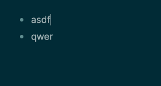

# logseq-plugin-extra-editing-commands

[Logseq](https://logseq.com/) plugin that provides additional editing functionality.

NOTE: This plugin does not set any default key bindings. You first need to adjust the settings to your liking.

---

## Insert above
Insert a new block _above_ the current one (no matter where the cursor currently is)

TODO: update gif

## Insert below
Insert a new block _below_ the current one (no matter where the cursor currently is)

TODO: gif

## Duplicate block
Duplicate the current block below the current one

TODO: gif

# ideas / todo
- [ ] duplicate current block including children
- [ ] jump along indent
- [ ] jump to next heading of same level
